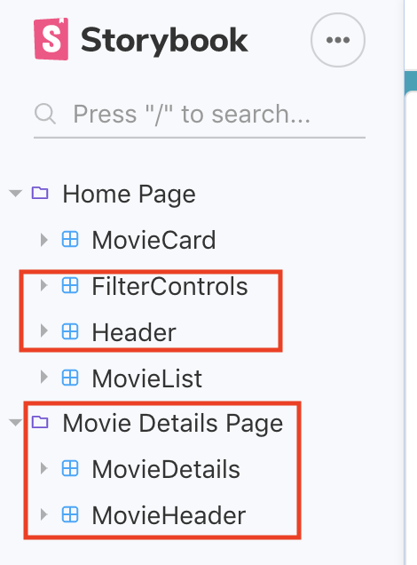
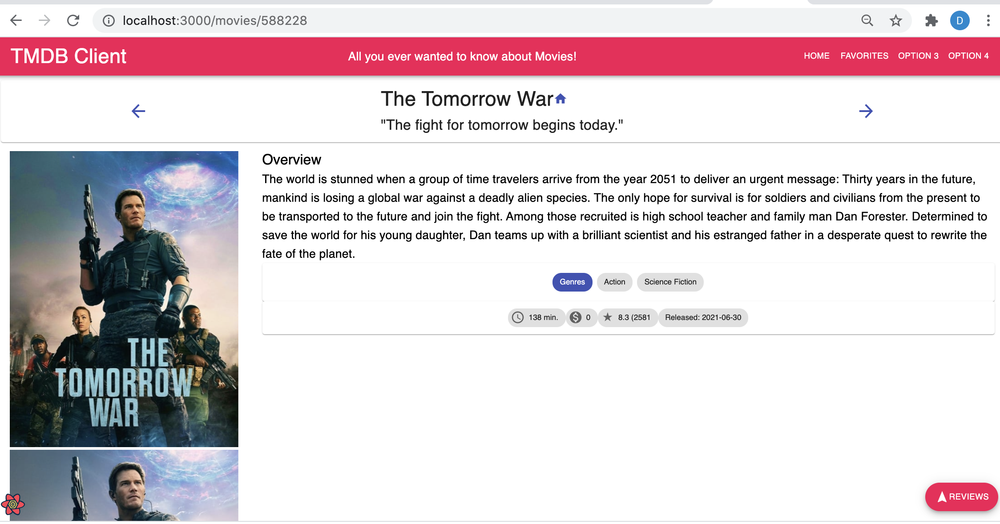

# Assignment 1 - ReactJS app.

Name: Keith Butler

## Overview.

A node.js movie searching app using tmdb api.

### Features.
 
+ Tv shows page 
+ Favourite Tv shows page 
+ Adding tv shows to favourites list
+ Actors page 
+ Favourite actors page 
+ Adding Actors to watch list

## Setup requirements.

    npm start

## API endpoints.

+ Discover list of movies - discover/movie
+ Movie details - movie/:id
+ Movie details - movie/:id/review
+ Movie genres = /genre/movie/list
+ Discover list of tv shows - discover/tv
+ Tv show details - tv/:id
+ Tv show review details - tv/:id/review

## App Design.

### Component catalogue.

[ Insert a screenshot from the Storybook UI that lists all the stories for the app's components, and highlight those relating to your __new/modified components__ - see the example screenshot below.] .......

### UI Design.

[ Insert screenshots of the __new/modified app pages__ you developed (and modified existing pages), Include an appropriate caption for each one (see example below).

>Shows detailed information on a movie. Clicking the 'Reviews' floating action button will display extracts from critic reviews.

>Shows detailed information on a movie. Clicking the 'Reviews' floating action button will display extracts from critic reviews.

### Routing.

+ /people - displays all known actors (not fully working).
+ //:id - displays a particular actor (not fully working).
+ /tv - displays all known tv shows.
+ /tv - displays all known tv shows.
+ /tv/:id - displays a particular actor (not fully working).
+ /tv/:id/review - displays a particular actor (not fully working).

[If relevant, state what aspects of your app are protected (i.e. require authentication) and what is public.]

## Independent learning (If relevant).

The api docs: https://developers.themoviedb.org/3/discover/tv-discover
